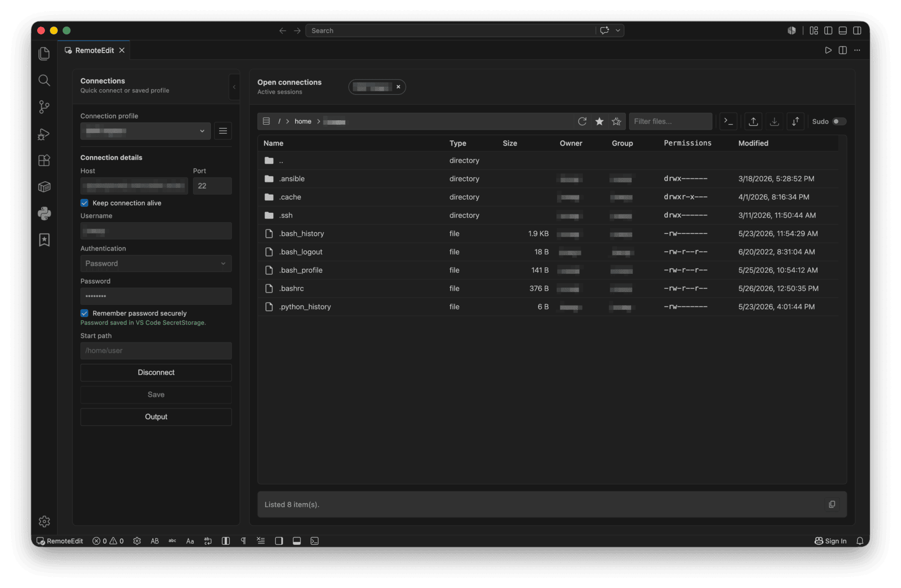

# Remote Edit

**Remote Edit** is a Visual Studio Code extension for browsing, editing, and saving remote files over SSH/SFTP directly from VS Code.

Connect to a server, browse directories, open files in the native VS Code editor, and save changes back to the remote system.



## Overview

Remote Edit is a lightweight SSH/SFTP file browser and editor for working with remote Linux/Unix servers directly from VS Code.

With Remote Edit, you can:

- browse remote directories over SSH/SFTP
- open and edit remote files directly in VS Code
- upload and download files or folders
- make copies, inspect properties, calculate server-side checksums, set permissions, and change owner/group for remote items
- save frequently used SSH connections as bookmarks
- work with privileged files using sudo mode

## Features

### Browse remote files over SSH/SFTP

Connect to a remote host and browse directories from a dedicated Remote Edit panel.

The file browser shows useful metadata such as type, size, owner, group, permissions, and modified date.

### Open and edit remote files in VS Code

Open remote files in the native VS Code editor and save changes back to the remote host using the normal save shortcut.

### Upload and download files or folders

Upload local files or folders to the current remote directory, or download selected remote files and folders to a local folder.

Folder transfers are recursive and keep their directory structure. When a file already exists at the destination, Remote Edit asks whether to overwrite, skip, apply the choice to all conflicts, or cancel.


### Permissions and ownership

Use the file browser context menu to set permissions or change owner/group for one or more selected remote items.

Permission changes support multi-select and can optionally apply recursively to selected directories. For mixed selections, the permissions dialog shows separate file and directory previews because special permission bits may behave differently for each type.

### Bookmarked connections

Save frequently used SSH/SFTP connections with host, port, username, authentication type, private key path, and start path.

### Password and private key authentication

Remote Edit supports password authentication and private key authentication, including optional private key passphrases.

When enabled, saved SSH passwords and private key passphrases are stored using VS Code Secret Storage.

### Sudo mode

Enable sudo mode when you need to work with files that require elevated permissions.

Sudo mode is used for privileged file operations such as reading, saving, creating files or directories, deleting, renaming, setting permissions recursively, and changing owner/group.

Sudo passwords are kept only in memory for the active session and are forgotten when sudo mode is disabled, the connection is closed, or VS Code is restarted.

### Multiple active connections

Open more than one remote session at the same time and switch between active connections inside the Remote Edit panel.

## Save behavior and file metadata

When saving an existing remote file, Remote Edit updates the file in-place instead of replacing it. This applies to both normal saves and sudo mode saves, helping preserve metadata such as inode, owner, group, permissions, and ACLs.

For new files and folders, Remote Edit does not force a permission mode. The remote server defaults and umask decide the final permissions.

On Unix-like systems, special permission bits such as setuid, setgid, and sticky may be cleared when a file is modified. By default, Remote Edit attempts to restore only the special bits that already existed before saving, when the remote system allows it.

You can disable this behavior with:

```json
"remoteedit.restoreSpecialPermissionBits": false
```

## How to Open Remote Edit

Open the Command Palette and run:

```text
Remote Edit: Open
```

You can also use the Remote Edit status bar button when it is enabled.

## Extension Settings

Remote Edit provides the following settings:

| Setting | Default | Description |
|---|---:|---|
| `remoteedit.showStatusBarButton` | `true` | Shows or hides the Remote Edit status bar button. |
| `remoteedit.statusBarButtonStyle` | `iconAndText` | Controls whether the status bar button shows icon and text, icon only, or text only. |
| `remoteedit.statusBarButtonAlignment` | `left` | Controls whether the status bar button appears on the left or right side of the status bar. |
| `remoteedit.statusBarButtonPriority` | `100` | Controls the status bar button ordering within the selected alignment group. |
| `remoteedit.sshReadyTimeout` | `30000` | Time, in milliseconds, to wait for an SSH connection to become ready. |
| `remoteedit.sshKeepAliveInterval` | `30000` | SSH keepalive interval, in milliseconds, when keepalive is enabled for the connection. |
| `remoteedit.sshKeepAliveCountMax` | `3` | Maximum unanswered SSH keepalive messages before the connection is considered lost. |
| `remoteedit.sudoTempDirectory` | `/tmp` | Remote directory used for temporary files when sudo mode saves privileged files. The connected SSH/SFTP user must be able to write to this directory. |
| `remoteedit.restoreSpecialPermissionBits` | `true` | Restores original setuid, setgid, and sticky permission bits after saving existing remote files, when the remote system allows it. |

SSH timeout and keepalive values are validated by Remote Edit. Invalid values entered manually in `settings.json` are ignored or clamped to the supported range.

## Security Notes

Remote Edit stores bookmarked connection metadata in VS Code global storage.

When the remember option is enabled, SSH passwords and private key passphrases are stored using VS Code Secret Storage.

Sudo passwords are not saved. They are kept only in memory for the active session and are forgotten when sudo mode is disabled, the connection is closed, or VS Code is restarted.

## Requirements

- VS Code 1.90.0 or newer
- Access to a remote host over SSH/SFTP
- Optional: sudo access on the remote host for sudo mode

## Limitations

- Sudo mode may not work on hosts that require a TTY for sudo.
- Existing files are saved in-place to help preserve metadata, so saves are not atomic and may be partially updated if interrupted.
- New files and folders use the remote server defaults and umask.
- Symbolic links are skipped during recursive upload and download.
- Remote Edit is not a full remote workspace environment.

## License

Remote Edit is free to use, but its source code is not open source.

The source code is publicly available for transparency and review only. Copying, modifying, redistributing, sublicensing, selling, or creating derivative works from this code requires prior written permission.

## Other Extensions

You may also like my other [VS Code extensions](https://marketplace.visualstudio.com/search?term=josegrabelha&target=VSCode).
