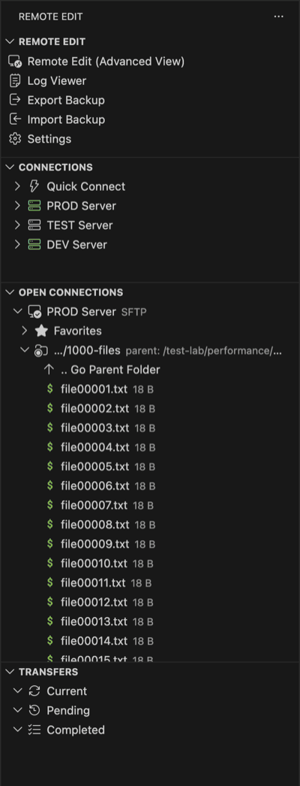
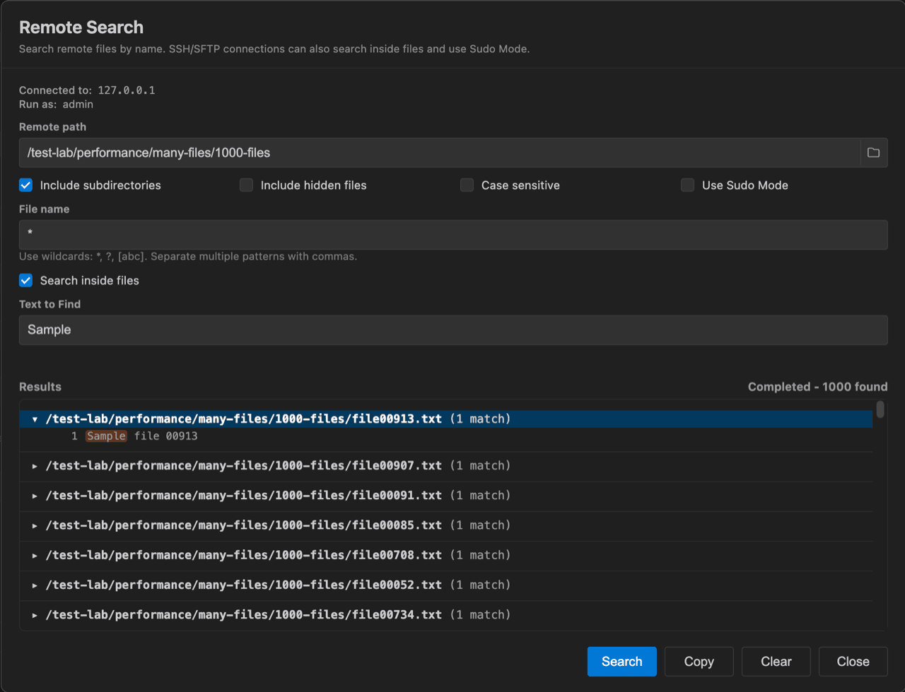
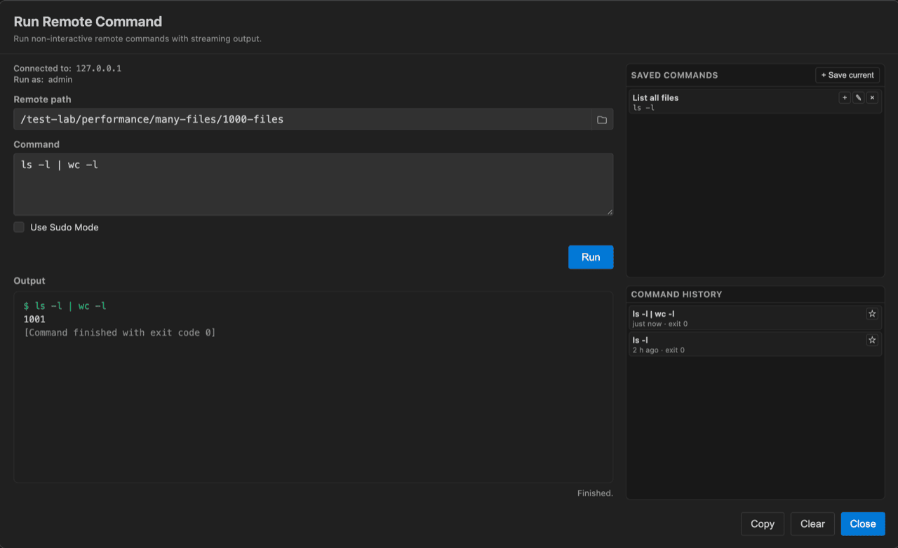
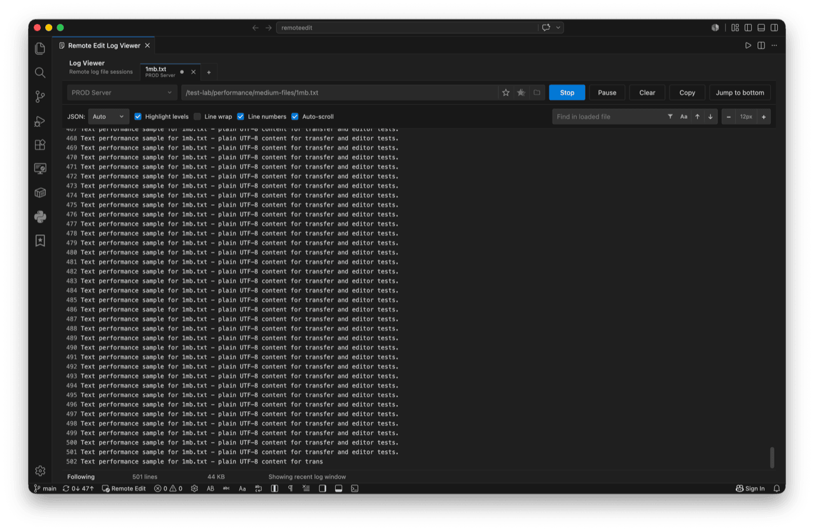

# Remote Edit

**Remote Edit** is a full-featured remote file manager and editor for Visual Studio Code with SSH/SFTP, FTP, and FTPS support.

Connect to remote servers, browse files, edit content directly in VS Code, transfer files, manage connections, and choose the workflow that fits you best.


## Two Ways to Work

### Full-Featured Remote Edit Webview

The Remote Edit Webview provides the complete visual experience for managing remote servers.

- Browse remote files and folders
- Open and edit files directly in VS Code
- Manage connections
- Run remote commands
- Search remote files by name or content
- Manage permissions and ownership
- Use Sudo Mode
- Upload and download files
- Monitor transfers

### Native VS Code Sidebar

Remote Edit also includes a fully native VS Code Sidebar experience.

Use it to manage connections, open sessions, favorites, transfers, SSH terminals, import/export operations, and Log Viewer access without leaving the VS Code interface.



Choose the workflow that fits you best. Use the full-featured Remote Edit Webview or the native VS Code Sidebar. Both experiences can be used independently.

## When to Use Remote Edit

Remote Edit is useful when you need to quickly browse, edit, upload or download files on remote servers without opening a full remote workspace.

## Webview or Native Sidebar?

Use the Webview when you want a complete visual file browser for remote files and folders.

Use the Native Sidebar when you prefer a compact VS Code workflow for connections, favorites, transfers, terminals and Log Viewer access.

## Highlights

- SSH/SFTP, FTP and FTPS support
- Full-featured Remote File Browser
- Native VS Code Sidebar
- Open files directly in VS Code
- SSH Terminal Access
- Unified Remote Search
- Dedicated Log Viewer
- Multiple Simultaneous Transfers
- Transfer Queue Management
- Import and Export Backups
- Sudo Mode
- Permissions and Ownership Management
- Favorites and Saved Connections
- Multiple Active Connections

## Why Remote Edit?

| Capability | Included |
|---|:---:|
| SSH/SFTP | ✓ |
| FTP | ✓ |
| FTPS | ✓ |
| Full Visual Webview | ✓ |
| Native VS Code Sidebar | ✓ |
| Multiple Active Connections | ✓ |
| Favorites | ✓ |
| Transfer Queue | ✓ |
| Multiple Simultaneous Transfers | ✓ |
| Import / Export | ✓ |
| SSH Terminal | ✓ |
| Remote Commands | ✓ |
| Remote Search | ✓ |
| Log Viewer | ✓ |
| Sudo Mode | ✓ |
| Permissions Management | ✓ |
| Owner / Group Management | ✓ |
| Checksums | ✓ |
| Archive Creation | ✓ |

## Supported Protocols

| Protocol | Browse | Upload | Download | Edit | File Search | Content Search | Remote Commands | Terminal | Log Viewer | Sudo Mode |
|---|:---:|:---:|:---:|:---:|:---:|:---:|:---:|:---:|:---:|:---:|
| SSH/SFTP | ✓ | ✓ | ✓ | ✓ | ✓ | ✓ | ✓ | ✓ | ✓ | ✓ |
| FTP | ✓ | ✓ | ✓ | ✓ | ✓ | - | - | - | - | - |
| FTPS | ✓ | ✓ | ✓ | ✓ | ✓ | - | - | - | - | - |

## Remote Search

Use Remote Search from the Webview toolbar to find remote files without leaving the current connection. Remote Search is Webview-only and keeps search state per active connection.



- Search file names and paths with wildcard support
- Choose a scope path manually or with the remote directory picker
- Include or exclude subdirectories
- Include or exclude hidden files
- Use case-sensitive matching when needed
- Search inside files on SSH/SFTP connections
- Use sudo for protected SSH/SFTP paths when Sudo Mode is available
- View live results while the search is running
- Keep searches running after closing the modal and track active searches with the toolbar badge
- Cancel long-running searches
- Copy all results, selected paths, or selected filenames
- Open result files in edit or read-only mode

FTP and FTPS connections support file name search. Content search and sudo search require SSH/SFTP.

## Run Remote Command

Run non-interactive commands on active SSH/SFTP connections without leaving the Webview.



- Open Run Remote Command from the Webview toolbar or from a remote directory context
- Choose the remote working directory manually or with the remote directory picker
- Stream stdout and stderr output while the command is running
- Stop long-running commands and force kill commands that do not stop cleanly
- Copy or clear command output
- Save frequently used commands per connection
- Reuse command history for the current connection
- Run with Sudo Mode when the active SSH/SFTP connection supports sudo

Remote Commands require SSH/SFTP because FTP/FTPS cannot execute remote shell commands.

## Log Viewer

Use Log Viewer from an active SSH/SFTP connection to monitor remote logs without cluttering the main file browser.



- Open logs from the Webview toolbar, file context menu, or Primary Sidebar context menu
- Tail and follow remote log files in real time
- Use Linux/Unix/AIX-friendly `tail` fallbacks
- Keep multiple logs open in tabs
- Pause and resume displayed updates with bounded buffering
- Search loaded log content, jump between matches, or show matching lines only
- Enable case-sensitive search when needed
- Auto-scroll with jump-to-bottom behavior
- Optional log level highlighting
- Optional JSON log formatting with `Auto`, `On`, and `Off` modes
- Optional line wrap and line numbers
- Uses Sudo Mode when the active SSH/SFTP connection has sudo enabled

Log Viewer is intentionally limited to SSH/SFTP connections because FTP/FTPS cannot run remote `tail -f` commands. The viewer shows continuity markers when the initial output is bounded, when portable `tail -f` is used, or when buffered/older loaded lines are discarded.

## Transfer Queue

Upload and download files with built-in queue management.

- Current transfers
- Pending transfers
- Completed transfers
- Individual transfer cancellation
- Progress tracking
- Multiple simultaneous transfers
- FTP, FTPS and SFTP support

```json
"remoteedit.maxConcurrentTransfers": 2
```

Default: 2  
Minimum: 1  
Maximum: 5

## SSH Terminal

For SSH/SFTP connections, Remote Edit can open native VS Code terminals directly from active connections.

Terminal access is available from both the Webview and the Native Sidebar.

## Sudo Mode

Need to edit protected system files?

Enable Sudo Mode and work with privileged files directly from VS Code.

Sudo passwords are never stored and are only kept in memory during the active session.

## File Operations

Use the Webview and Native Sidebar context menus to manage remote files and folders.

- View/Edit files or open them as read-only
- Create, rename and delete remote files and folders
- Make a copy of an existing remote file
- Compare two selected remote files
- Compress files or folders to remote archives
- View file and folder properties
- Calculate checksums
- Copy remote paths, filenames, or the current remote path
- Refresh listings after remote changes

## Permissions and Ownership

Manage permissions, owners and groups directly from VS Code.

- Multiple selection support
- Recursive updates
- File and folder support

## Upload and Download

Transfer files and folders between your local machine and remote servers.

- Recursive folder transfers
- Conflict handling
- Progress tracking
- Queue management
- Multiple simultaneous transfers

## Saved Connections

Save frequently used SSH/SFTP, FTP and FTPS connections for quick access.

- Password authentication
- SSH private key authentication
- Optional private key passphrases
- Start paths
- Connection favorites
- Secure credential storage

## Import and Export

Create password-protected backups of:

- Remote Edit settings
- Saved connections
- Remote path favorites
- Encrypted credentials

Import supports Merge and Replace modes and provides a summary before changes are applied.

## Quick Access

Open Remote Edit from:

- Command Palette
- VS Code Primary Sidebar
- Editor Title Bar Button
- Status Bar Button

## Native Sidebar Details

The Primary Sidebar provides quick access to the main Remote Edit Webview, Log Viewer, saved connections, Quick Connect, open remote sessions, favorites and transfers.

The Log Viewer item appears below `Remote Edit (Advanced View)` and is enabled only when there is an active SSH/SFTP connection.

## Multiple Active Connections

Work with multiple remote servers at the same time and quickly switch between active connections.

## Extension Settings

### User Interface

- `remoteedit.editorTitleButtonPosition`
- `remoteedit.statusBarButtonPosition`
- `remoteedit.statusBarButtonStyle`
- `remoteedit.statusBarButtonPriority`

### Sidebar

- `remoteedit.sidebar.showItemInfoOnHover`
- `remoteedit.sidebar.showParentPath`

### SSH/SFTP

- `remoteedit.sshReadyTimeout`
- `remoteedit.sshKeepAliveInterval`
- `remoteedit.sshKeepAliveCountMax`
- `remoteedit.sftpResolveOwnerGroupNames`

### FTP/FTPS

- `remoteedit.ftpKeepAliveInterval`
- `remoteedit.ftp.enableModifiedDateFallback`

### Transfers

- `remoteedit.maxConcurrentTransfers`

### Sudo

- `remoteedit.sudoTempDirectory`
- `remoteedit.restoreSpecialPermissionBits`

### Cache

- `remoteedit.directoryListingCacheTtl`

### Log Viewer

- `remoteedit.logViewer.maxBackgroundBufferLines`

### Diagnostics

- `remoteedit.diagnostics.debugLogs`
- `remoteedit.diagnostics.performanceLogs`

Enable debug and performance logs when troubleshooting directory browsing, cache behavior, transfers, Remote Search, or Log Viewer sessions. Then reproduce the issue and copy the relevant entries from the `Remote Edit` Output channel when opening a GitHub issue.

## Security

- Credentials can be stored using VS Code Secret Storage
- FTPS supports certificate validation
- Sudo passwords are never saved
- Password-protected import/export backups
- SFTP and FTPS are recommended for secure connections

## Requirements

- VS Code 1.90.0 or newer

## Notes

- Symbolic links are skipped during recursive transfers.

## License

Remote Edit is free to use for personal and professional use through the official Visual Studio Code Marketplace distribution.

The source code is publicly available for transparency and review only. Copying, modifying, redistributing, sublicensing, selling, or creating derivative works from this source code requires prior written permission from the copyright holder.
