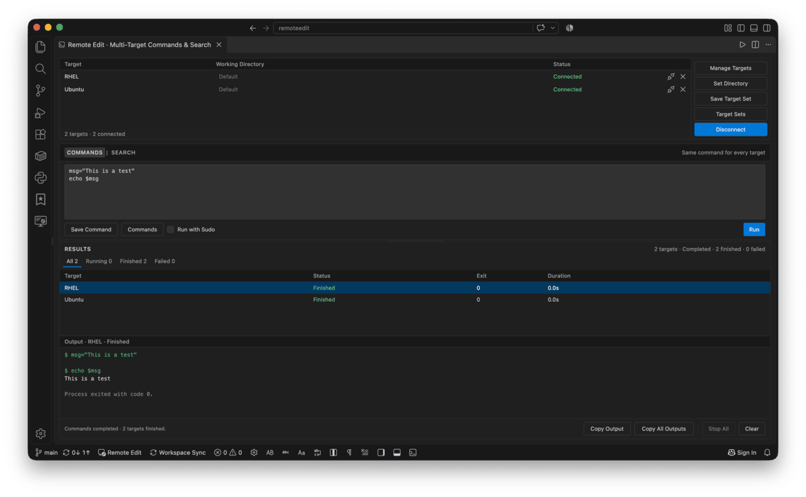

# Remote Edit

<p align="center">
  <a href="https://marketplace.visualstudio.com/items?itemName=josegrabelha.remoteedit"></a>
  <a href="https://open-vsx.org/extension/josegrabelha/remoteedit"></a>
  
  
  
</p>

**Remote Edit** is a VS Code extension for browsing, editing, transferring, searching, and synchronizing files over SSH/SFTP, FTP, and FTPS. It combines a full visual remote file browser, a native VS Code Sidebar, **Workspace Sync**, **Multi-Target Commands & Search**, and SSH/SFTP server tools for commands, logs, terminals, port forwarding, and Server View.

Remote Edit supports Linux, Unix, AIX, and Windows OpenSSH targets, with protocol-specific features available depending on the remote server.


## Installation

Remote Edit is available on the [Visual Studio Code Marketplace](https://marketplace.visualstudio.com/items?itemName=josegrabelha.remoteedit) and the [Open VSX Registry](https://open-vsx.org/extension/josegrabelha/remoteedit).

## Getting Started

1. Open **Remote Edit (Advanced View)** from the VS Code Activity Bar, or run **Remote Edit: Open** from the Command Palette.
2. To create a saved connection, choose **Add Connection** in the Native Sidebar and follow the prompts. Alternatively, select **New / Quick Connection** in the Advanced View and enter your server details.
3. Select **SFTP**, **FTP**, or **FTPS** and configure the host, port, and authentication. Add a Proxy or Jump Host if needed.
4. Connect to browse and edit remote files. In the Advanced View, use **Save** to keep a new connection profile for later use.

## Highlights

- SSH/SFTP, FTP, and FTPS connections with direct remote file editing
- Full Remote Edit Webview and Native VS Code Sidebar
- Workspace Sync with multi-target and automatic synchronization
- Multi-Target Commands & Search with reusable Target Sets
- Multiple active connections, concurrent transfers, and Transfer Queue
- Remote Search by name and SSH/SFTP file content
- SSH server tools: Server View, Terminal, Remote Commands, Quick Tasks, and Log Viewer
- Local and reverse SSH port forwarding
- SFTP Jump Hosts and reusable SOCKS4, SOCKS5, and HTTP CONNECT proxy profiles
- Saved connections, groups, favorites, and secure credentials
- Import connections from OpenSSH, FileZilla, WinSCP, PuTTY, SSH FS, and VS Code SFTP
- Password-protected import/export backups
- Sudo Mode, permissions, ownership, checksums, and archive operations

## Remote Edit Webview

The **Remote Edit (Advanced View)** provides the complete visual workflow for managing remote servers.

- Browse remote files and folders
- Open and edit files directly in VS Code
- Upload and download files and folders
- Manage saved connections and connection groups
- Run remote commands and Quick Tasks
- Search remote files by name or content
- Use Server View for system information and server-side actions
- Manage permissions and ownership
- Use Sudo Mode where supported
- Monitor transfers

The Webview and Native Sidebar can be used independently or together.

## Native VS Code Sidebar

Remote Edit also includes a native VS Code Sidebar for compact day-to-day access to connections and tools.


Use the Sidebar to access:

- **Remote Edit (Advanced View)**
- **Workspace Sync**
- **Multi-Target Commands & Search**
- **Log Viewer**
- Saved connections and Quick Connect
- Open Connections
- Favorites
- Transfers
- SSH Terminal actions
- Import and Export, including connections from other applications

## Remote File Editor Labels

In VS Code settings, **Remote Edit: UI → Editor Root Label** (`remoteedit.editorRootLabel`) controls the virtual root shown in editor breadcrumbs and tab path descriptions:

- `host` (default): use the target hostname, consistently for files opened from the Webview and Sidebar.
- `connectionName`: use `group | connection` as a single root, or just `connection` when there is no group. This helps distinguish connections that share a hostname or loopback address. Quick Connect and sessions whose saved profile was removed use the session name.

The virtual root represents the remote `/` directory; it does not change the file's actual remote path. Normal, read-only, and comparison editors use the same naming rules. VS Code controls when tab path descriptions appear and how they are shortened.

Changes apply to subsequent file opens. Close and reopen existing editors to use the current setting or updated connection names; their unsaved contents and undo history are not migrated or modified by changing the setting.

## Why Remote Edit?

| Capability | Included |
|---|:---:|
| SSH/SFTP, FTP, and FTPS | ✓ |
| Advanced View and Native Sidebar | ✓ |
| Workspace Sync | ✓ |
| Multi-Target Commands & Search | ✓ |
| Multiple Active Connections | ✓ |
| Favorites, Saved Connections, and Groups | ✓ |
| Transfer Queue and Simultaneous Transfers | ✓ |
| Import Connections from Other Applications | ✓ |
| Proxy Profiles and SFTP Jump Hosts | ✓ |
| Password-Protected Import / Export | ✓ |
| Remote Search | ✓ |
| Server View | ✓ |
| SSH Terminal, Remote Commands, and Quick Tasks | ✓ |
| Log Viewer | ✓ |
| Local and Reverse SSH Port Forwarding | ✓ |
| Sudo Mode | ✓ |
| Permissions and Ownership Management | ✓ |
| Checksums and Archive Creation | ✓ |

## Workspace Sync

Open **Workspace Sync** from the Remote Edit Sidebar, directly below **Remote Edit (Advanced View)**. Workspace Sync synchronizes a local directory with one or more saved Remote Edit connections without requiring a full remote VS Code workspace.


Create a **mapping** with a Local Root and one or more remote targets. Each target uses a saved SFTP, FTP, or FTPS connection and an absolute Remote Directory.

### Mappings and targets

- Use **Local → Remote**, **Remote → Local**, or **Bidirectional** direction
- Add multiple independently enabled targets to the same mapping
- Select an individual target or **All Enabled** to work across enabled targets together
- Use saved SFTP connections with their configured Jump Host chains
- Keep an independent synchronization baseline for each mapping/target
- Prevent duplicate synchronization routes that point the same Local Root to the same connection and Remote Directory
- Configure Ignore patterns per mapping; `.git/` and `node_modules/` are ignored by default
- Workspace Sync uses its own Ignore list and does not read `.gitignore`

### Refresh and Changes

Connecting a target automatically performs a **Refresh** of the Local and Remote state. With **All Enabled**, Workspace Sync establishes target connections concurrently before starting the initial comparisons and Watch reconciliation. You can switch mappings and targets while this work runs; individual transfers stay unavailable until the corresponding target has finished preparing. Use **Refresh** at any time to reconcile the current state again.

When multiple connected targets share a Local Root, Workspace Sync can reconcile independent files concurrently. Operations affecting the same file or related directories wait for each other and revalidate their plan before execution. Directory-structure changes and potentially overlapping remote destinations retain broader protection. This also applies to Watch Local, Watch Remote, and manual Sync; switching the visible mapping or target does not redirect in-flight operations.

The **Changes** view provides:

- Changes, Modified, Local, Remote, Conflicts, Same, and All filters
- Path filtering and sortable Target, Path, and Status columns
- Optional sortable **Local Modified** and **Remote Modified** columns through **Show Modified Times**; local timestamps include their UTC offset, while FTP/FTPS remote timestamps that are server-local are labeled `server`
- Optional **Hide Unsupported Files** filtering for confirmed symlinks and unsupported filesystem entry types
- Multi-selection with Upload and Download actions
- Local/Remote comparison with the Workspace Sync internal text viewer or **Open in VS Code**; **Default Compare** chooses which viewer the primary Compare action opens, while both remain available explicitly
- Conflict choices with **Use Local**, **Use Remote**, and **Skip**
- Bulk conflict controls with **All Local**, **All Remote**, **All Skip**, and advisory **Apply Suggestions**; these controls only select resolutions and never start Sync automatically
- A **Sync Review** before planned synchronization is applied; resolution decisions recalculate the temporary plan, including parent/child structural dependencies, before **Start Sync**
- **Reset Baseline…** to clear synchronization history without modifying Local or Remote files
- A read-only last known state while disconnected, until the next successful Refresh

With **All Enabled**, Workspace Sync aggregates enabled targets into one Changes view and can Refresh or Sync the connected targets together. Disconnected targets are not connected automatically.

### Automatic synchronization

Workspace Sync can automate selected workflows while a target is connected:

- **Upload on Save** — uploads files saved from the VS Code editor
- **Watch Local Changes** — reacts to local filesystem changes
- **Watch Remote Changes** — monitors changes on the remote target
- **Unknown Change Protection** — prevents automatic decisions when there is not enough trusted history to determine the safe side
- **Atomic Transfer when supported** — avoids replacing the destination until a transfer completes successfully
- **Propagate Deletes** — allows deletions to flow according to the selected sync direction; propagated directory deletes remove the complete destination subtree, including hidden and ignored descendants. Ignore rules do not preserve files inside a directory whose deletion is being propagated, and new or changed content detected after validation causes the delete to be deferred and re-evaluated

Watch and Upload on Save never establish a connection by themselves. Automatic resources are active only for targets that the user has explicitly connected.

In one-way modes, the configured source side is authoritative for automatic watch actions. In Bidirectional mode, Workspace Sync compares both sides against the stored baseline and keeps conflicts or ambiguous differences manual.

### Activity and operation status

The **Activity** section records connection changes, manual and automatic operations, file results, conflicts, retries, cancellations, and actionable error details with local timestamps.

The bottom operation status shows the current lifecycle, such as Connecting, Refreshing, Syncing, Uploading, Downloading, Cancelling, or Disconnecting. Multi-target operations show aggregate progress while detailed per-target events remain in Activity.

Activity also provides **Follow latest**, **Copy**, and **Clear** controls. Credentials are redacted from Activity messages. The most recent **1,000 Activity events** are kept locally across VS Code reloads and restarts; **Clear** removes that saved local history.

### Workspace Sync backup behavior

Import/Export can include Workspace Sync mappings, targets, options, and saved Workspace Sync preferences such as **Hide Unsupported Files**, **Show Modified Times**, and **Default Compare**. Operational state such as Activity history, active sessions, comparison snapshots, current selection, and synchronization baselines stays local and is not exported.

## Multi-Target Commands & Search

Open **Multi-Target Commands & Search** from the Remote Edit Sidebar. The **Commands** and **Search** tabs share targets, Working Directories, open connections, and Target Sets while keeping their own inputs, results, selection, scroll, and two-line status. Switching modes does not cancel active work; **Stop All** and **Clear** apply to the active mode. Commands and Search can run concurrently, including on the same target. Sudo preparation and launch are coordinated so each operation keeps its own permission context.



### Targets and Target Sets

- Choose saved SSH/SFTP connections using connection search and an optional Connection Group filter
- Set an optional Working Directory per target; Default uses the SSH session directory
- Connect explicitly with the global or per-target controls; operations use connected targets only
- Use shared **Target Sets** across Commands and Search
- Save each Target Set with its connection membership and per-target Working Directory
- Edit a saved Target Set without changing the original saved connection
- Update the currently loaded Target Set with **Save**, or create a separate set with **Save New**
- Keep saved Target Sets available across VS Code restarts

The live Multi-Target workspace is session-only. Closing and reopening the view during the same VS Code session restores the current targets, loaded Target Set, Working Directories, inputs, connections, results, selection, scroll, status, and divider position. Restarting or reloading VS Code starts **Multi-Target Commands & Search** with a clean runtime state; saved Target Sets and Saved Commands remain available.

### Commands

- Run the same command or multiline script across targets, with up to five executions in parallel
- Reuse Saved Commands without changing target Working Directories
- Run with Sudo on supported SSH/SFTP targets
- Follow live status, exit code, duration, and separate output for each target
- Filter results, copy selected output, stop one target, or stop all active executions
- Resize Commands and Results with the divider; Targets stays fixed with internal scrolling
- Keep the latest 512K characters of output per target, with truncation clearly marked

Files, Workspace Sync, and Run Remote Command keep their existing independent connection and execution flows.

### Search

Select the **Search** tab in the same view.

- Use the same targets, Working Directories, Target Sets, connections, custom tooltips, and menus as Commands
- Search filenames with wildcard patterns, or enable **Search inside file** to reveal **Text to find**
- Set **Include subdirectories**, **Include hidden files**, and **Case sensitive**
- Run with Sudo on supported SSH/SFTP targets
- Search connected SSH/SFTP targets with up to five searches in parallel using the existing Remote Search engine
- Follow status, result count, and duration per target
- Inspect grouped files, matching lines, and highlighted snippets
- Copy results, stop individual targets or all searches, and clear finished results
- Use the same resizable Results area and independent Search status as Commands

Search never connects or reconnects targets. A failed target does not interrupt the others. There are no Saved Searches.

### Backup behavior

Backup/Restore exposes one **Multi-Target Commands & Search** category for the feature's saved data, including shared Target Sets and Multi-Target Saved Commands. Per-target Working Directories stored in Target Sets are included. Runtime-only state such as the currently loaded Target Set, selected targets, current Working Directories outside saved sets, command/search fields, live connections, results, output, status, selection, scroll position, and divider position is not exported.

## Supported Protocols

### File Operations and Synchronization

| Protocol | Browse / Edit | Upload / Download | File Search | Content Search | Workspace Sync |
|---|:---:|:---:|:---:|:---:|:---:|
| SSH/SFTP on Linux/Unix/AIX | ✓ | ✓ | ✓ | ✓ | ✓ |
| SSH/SFTP on Windows OpenSSH | ✓ | ✓ | ✓ | ✓ | ✓ |
| FTP | ✓ | ✓ | ✓ | - | ✓ |
| FTPS | ✓ | ✓ | ✓ | - | ✓ |

### Connection & Server Tools

| Protocol | Multi-Target | Remote Commands | Server View | Terminal | Log Viewer | Sudo Mode | Proxy | Jump Hosts |
|---|:---:|:---:|:---:|:---:|:---:|:---:|:---:|:---:|
| SSH/SFTP on Linux/Unix/AIX | ✓ | ✓ | ✓ | ✓ | ✓ | ✓ | ✓ | ✓ |
| SSH/SFTP on Windows OpenSSH | ✓ | ✓ | ✓ | ✓ | ✓ | - | ✓ | ✓ |
| FTP | - | - | - | - | - | - | ✓ | - |
| FTPS | - | - | - | - | - | - | ✓ | - |

**Multi-Target** refers to **Multi-Target Commands & Search** and requires saved SSH/SFTP connections. FTP and FTPS are not supported in Multi-Target.

FTP and FTPS Remote Search support file-name/path search. Content search requires SSH/SFTP.

**Proxy Support** includes SOCKS4, SOCKS5, and HTTP CONNECT for SSH/SFTP, FTP, and FTPS connections, including compatible SSH Jump Host routes.

## Server View

Switch an active SSH/SFTP connection from **Files** to **Server** to inspect and manage common server-side information without leaving Remote Edit.


- Review system information, uptime, memory, disk, load, shell, home directory, and current user details
- Inspect services and run supported start, stop, and restart actions
- Review running processes and kill selected processes when needed
- Open, follow, edit, or copy saved server log shortcuts
- Review user and system scheduled jobs on Linux/Unix/AIX, or Scheduled Tasks on Windows OpenSSH
- Manage local and reverse SSH port forwarding definitions
- Run Saved Commands as Quick Tasks
- Use manual refresh or optional auto-refresh intervals

Server View is available for Linux/Unix/AIX SSH/SFTP connections and Windows OpenSSH sessions. Windows Server View uses PowerShell for supported system information and management tasks. Sudo Mode is not available on Windows OpenSSH targets.

## Remote Search

Use Remote Search from the Webview toolbar to find remote files without leaving the current connection.


- Search file names and paths with wildcard support
- Choose a scope path manually or with the remote directory picker
- Include or exclude subdirectories and hidden files
- Use case-sensitive matching when needed
- Search inside files on SSH/SFTP connections
- Use Sudo Mode for protected SSH/SFTP paths when available
- View live results while the search is running
- Keep searches running after closing the dialog
- Stop long-running searches
- Copy results, paths, or filenames
- Open results in edit or read-only mode

FTP and FTPS support file-name/path search. Content search requires SSH/SFTP.

## Run Remote Command

Run non-interactive commands on active SSH/SFTP connections without leaving the Webview. Windows OpenSSH sessions use PowerShell for command features.


- Run commands from the Webview toolbar or a remote directory context
- Choose the remote working directory manually or with the directory picker
- Stream stdout and stderr
- Stop long-running commands and force-kill commands that do not stop cleanly
- Copy or clear output
- Save frequently used commands per connection
- Save and restore the Remote Path for each Saved Command
- Reuse session command history
- Run with Sudo Mode when supported

Saved Commands are also available as **Quick Tasks** in Server View. Command history is session-only and is not included in backups.

## Log Viewer

Use Log Viewer from an active SSH/SFTP connection to monitor remote logs without cluttering the main file browser.


- Open logs from the Webview toolbar, file context menu, or Sidebar
- Tail and follow remote log files in real time
- Keep multiple logs open in tabs
- Pause and resume displayed updates with bounded buffering
- Search loaded content, navigate matches, or show matching lines only
- Enable case-sensitive search
- Use stable auto-scroll with pending-line awareness and jump-to-latest behavior
- Highlight common text and structured log levels, including Linux/Unix/AIX and Windows-oriented formats
- Handle ANSI-colored output and multiline stack traces
- Format JSON logs with `Auto`, `On`, and `Off` modes
- Toggle line wrap and line numbers
- Use Sudo Mode when the active SSH/SFTP connection supports it

Log Viewer is limited to SSH/SFTP because FTP/FTPS cannot run remote follow commands.

## Transfer Queue and File Transfers

Upload and download files and folders with built-in queue management.

- Current, pending, and completed transfers
- Individual transfer cancellation
- Progress tracking
- Multiple simultaneous transfers
- Recursive folder transfers
- Conflict handling
- FTP, FTPS, and SFTP support
- Drag-and-drop upload from the OS into the Webview or Sidebar Open Connections tree

In the Webview, hovering over a remote folder while dragging can open that folder before the drop, including `..` for the parent folder.

Configure normal Remote Edit transfer concurrency with:

```json
"remoteedit.maxConcurrentTransfers": 2
```

Default: `2`
Minimum: `1`
Maximum: `5`

## SSH Terminal

For SSH/SFTP connections, Remote Edit can open native VS Code terminals directly from active connections.

Terminal access is available from both the Webview and the Native Sidebar.

## Port Forwarding

For SSH/SFTP connections, Remote Edit can manage **Local** and **Remote** SSH port forwarding definitions from Server View.

- **Local** — local-to-remote forwarding
- **Remote** — reverse, remote-to-local forwarding
- Start and stop forwards from the Port Forwarding card
- Optionally auto-start selected forwards when a connection opens
- Save forwarding definitions in Remote Edit backups

Reverse forwarding asks the remote SSH server to listen on a bind host/port and forward incoming connections back to a target reachable from your machine. Binding reverse forwards to non-loopback remote addresses depends on the remote SSH server configuration, including `GatewayPorts` where applicable.

Backups store forwarding definitions, not their current running/stopped state.

## SFTP Jump Hosts

Saved SFTP connections can reach a target through one or more other saved SFTP profiles.

Set **Jump Host** to **Direct connection** or select another saved SFTP profile. Jump Hosts can themselves use another saved SFTP Jump Host, allowing multi-hop chains such as:

```text
Local → D → C → B → A
```

For a target `A` reached through `B`, `C`, and outermost host `D`:

1. Set `D` to **Direct connection**.
2. Set `C` to use `D`.
3. Set `B` to use `C`.
4. Set `A` to use `B`.

Remote Edit validates missing profiles, self-references, cycles, and invalid non-SFTP hops before connecting. Each hop uses its own saved or prompted credentials. Passwords and private-key passphrases are stored only when explicitly saved through VS Code Secret Storage.

Jump Host references are preserved by current Remote Edit backups. Workspace Sync also resolves the Jump Host chain of saved SFTP connections used by its targets.

FTP and FTPS do not use SSH Jump Hosts, but both can connect through a configured proxy.

## Sudo Mode

Need to edit protected system files on supported SSH/SFTP targets? Enable **Sudo Mode** and work with privileged files directly from VS Code.

Sudo passwords are never stored and are kept only in memory for the active session.

## Remote File Browser and File Operations

Use the Webview and Native Sidebar context menus to manage remote files and folders.

- View/Edit files or open them read-only
- Create, rename, and delete remote files and folders
- Make a copy of an existing remote file
- Compare two selected remote files
- Compress files or folders into remote archives where supported
- View file and folder properties
- Calculate checksums
- Copy remote paths, filenames, or the current path
- Cut and paste remote files or folders within the same connection
- Drag selected remote items onto folders to move them within the same connection
- Refresh listings after remote changes

### Remote Path breadcrumb

The Remote Path bar includes clickable breadcrumb chevrons for navigating parent and sibling directories. On POSIX-compatible SSH/SFTP targets, the picker can show owner/group and permission details.

```json
"remoteedit.webview.remotePathBreadcrumb.showDirectoryDetails": true
```

Default: `true`

### Permission display

The Webview file list and Remote Path picker can show POSIX permissions as symbolic, numeric, or both. Numeric values use four-digit octal notation so special bits remain visible.

```json
"remoteedit.webview.fileList.permissionsDisplay": "symbolic"
```

Supported values: `symbolic`, `numeric`, `both`
Default: `symbolic`

Windows OpenSSH sessions hide POSIX owner/group/permission metadata because NTFS ACLs do not map reliably to SFTP POSIX fields.

### Permissions and ownership

On supported POSIX-compatible SSH/SFTP targets, Remote Edit can update permissions, owner, and group information, including multiple selection and recursive operations.

## Saved Connections

Save frequently used SSH/SFTP, FTP, and FTPS connections for quick access.

- Connection groups
- Password authentication with an individual password or a shared Master Password
- SSH private-key authentication
- Optional private-key passphrases
- Start paths
- Favorites
- Reusable Proxy Profiles for SFTP, FTP, and FTPS
- Jump Host references for SFTP profiles
- Secure credential storage through VS Code Secret Storage

Use **Clone** to create an independent copy of a saved connection. Use the **Save** split button and **Save As...** to create a new saved profile from the current values without modifying the original.

In the Advanced View, **Connection & Settings Management** provides access to **Manage Connections**, **Manage Proxies**, **Master Password**, **Import**, **Export**, and **Settings**.

**Manage Connections** provides group management, Clone, Delete, and full **Edit** of saved connections. Edit includes **Profile** and **Group** above the connection settings, with protocol-specific authentication, credentials, Proxy, Jump Host, and FTPS options. Saving updates the Advanced View and Native Sidebar immediately while preserving unsaved connection drafts and keeping active sessions connected. **Back** confirms before discarding unsaved edits. The Proxy selector also provides **New Proxy** for creating and selecting a profile without leaving the form.

**Master Password** can be used as a shared password source across Remote Edit and managed from **Connection & Settings Management → Master Password**. It is stored securely in VS Code SecretStorage, and private-key authentication is unchanged.

Backup/Restore preserves the selected password source and can include the Master Password when encrypted credentials are exported. During Merge, an existing different Master Password is kept unless you choose to replace it.

## Import and Export

Create password-protected backups of Remote Edit data, including selected categories such as:

- Remote Edit settings
- Saved connections and Proxy Profiles
- Remote Path favorites
- Encrypted credentials when explicitly selected
- Saved Commands and their Remote Paths
- Port Forwarding definitions
- Server Log Shortcuts
- Log Viewer favorite files
- Workspace Sync mappings, targets, and options
- Multi-Target Saved Commands and Target Sets

Import supports **Merge** and **Replace** modes and shows a summary before changes are applied. Webview and Sidebar import/export actions use the same backend data source.

Operational and session-only state is not included in backups. Examples include open tabs, active connections, running transfers, Sudo Mode state, Log Viewer buffers, command history, Multi-Target runtime state, Workspace Sync Activity history, sessions, comparison snapshots, and synchronization baselines. Workspace Sync Activity is retained locally across VS Code reloads and restarts, but it is not transferred through Import/Export.

## Import Connections

In the Advanced View, choose **Connection & Settings Management → Import → Import Connections from Other Applications**. In the Native Sidebar, choose **Import → Import Connections from Other Applications (Webview)** to open the same modal. Select detected sources or choose source files manually, then review the combined list. Click a row to inspect its details and use its checkbox to include or exclude it. Conflicts default to **Import as New** and can optionally use **Replace**. No connections are saved until you click **Import**.

Supported sources and compatibility:

| Application | Supported input | Important limitations |
| --- | --- | --- |
| **OpenSSH** | SSH configuration files, including `Include` files and host aliases | Resolves host patterns, defaults, and `ProxyJump` chains. Conditional `Match` rules may require manual review; only the first applicable identity is imported. Supports compatible `nc -X 4/5/connect -x host:port %h %p` `ProxyCommand` forms; other commands require manual migration and are never executed. Include required Jump Host profiles in the same import. |
| **FileZilla** | Site Manager XML and companion `filezilla.xml` proxy settings when available | Supports saved or unlockable credentials and explicit FTPS; implicit FTPS is unsupported. Opportunistic TLS becomes required explicit TLS with a warning. Compatible global SOCKS4, SOCKS5, and HTTP CONNECT settings are imported unless bypassed by a site; Site Manager exports alone may omit these settings. |
| **WinSCP** | INI files or detected Windows Registry sessions | Supports recoverable or unlockable credentials and compatible SOCKS4, SOCKS5, and HTTP CONNECT proxies. SCP, WebDAV, S3, SSH tunnels, and unsupported proxy methods require manual migration. |
| **PuTTY** | Windows Registry, `.reg` exports, or Unix saved-session files | SSH sessions only, with compatible SOCKS4, SOCKS5, and HTTP CONNECT proxies. `.ppk` keys must be converted to OpenSSH format. Saved SSH passwords are not available from PuTTY; unsupported proxy methods need manual migration. |
| **SSH FS** | VS Code settings, `.code-workspace` files, configuration arrays, and referenced config paths | Supports representable `label`, `group`, `extend`, and `hop` settings and compatible `proxy` objects. Embedded private keys, unresolved PuTTY references, and `sshConfigPath` settings require manual configuration. |
| **VS Code SFTP** | Supported `sftp.json` / JSONC variants | Supports profile overrides, recoverable passwords/passphrases, and compatible `proxy` objects. Unsupported remote hops, external SSH settings, and embedded private keys require manual configuration. |

Source detection uses standard application locations on the VS Code extension host, including Windows Registry sessions and PuTTY sessions in `~/.putty/sessions/` on Linux/macOS. Portable installations and configurations copied from another machine can be selected manually. Detection does not launch external applications or modify source files. Configuration files are limited to **2 MiB** each, with up to **2,000 connections** per review.

Recoverable credentials use Remote Edit's existing secure storage. Protected FileZilla and WinSCP credentials may be unlocked by source/key group; if selected connections remain locked, a confirmation offers batch unlock or import without the protected credentials. The external password does not change Remote Edit's Master Password. Replacing a connection may replace or clear its saved credentials; the confirmation warns about this risk. Open sessions are not reconnected automatically.

Compatible proxy settings create or reuse Remote Edit Proxy Profiles, with available passwords stored securely. Unavailable proxy credentials are reported as warnings and must be completed after import. Unsupported proxy configurations are not silently converted to direct connections. Credential values are not displayed in the review or comparison views.

Imported connection groups preserve source folder paths as group names where available. Some application-specific settings cannot be translated directly, so review warnings, authentication, directories, proxies, and Jump Host dependencies before importing. Imports save connections one at a time rather than as a single transaction: if one fails, previous successful saves are not automatically rolled back. Review the saved connections before retrying.

**Import → Import Remote Edit Backup** retains the existing backup restore flow in the Advanced View and Sidebar. **Export** retains the existing backup export flow.

## Proxy Support

Create reusable **SOCKS4**, **SOCKS5** or **HTTP CONNECT** profiles in **Connection & Settings Management → Manage Proxies**. Select a profile using the **Proxy** field in the Advanced View or Native Sidebar. Existing connections default to **No Proxy**. The Native Sidebar proxy picker keeps **New Proxy** and **Manage Proxies (Webview)** at the top, including while filtering. **New Proxy** uses a native wizard and selects the created profile in the current connection draft; save the connection to persist that association. **Manage Proxies (Webview)** opens the existing Proxy Profiles modal directly. **Add Connection** also offers this picker before Jump Host. Updating proxy profiles preserves unsaved connection drafts.

Each proxy has a name, host and port. SOCKS4 accepts an optional User ID and no password. SOCKS5 and HTTP CONNECT support no authentication or username/password authentication; HTTP CONNECT uses Basic. Proxy passwords use VS Code SecretStorage independently of server credentials. SOCKS and plain HTTP proxies do not encrypt proxy authentication traffic; use them on a trusted network. SFTP and FTPS retain their own transport encryption.

A profile can be shared by multiple connections. Editing it takes effect on the next connection or reconnection. Deleting a profile is blocked while saved connections reference it. To change a saved password, enter a new value; leave the password field empty to keep it.

SFTP, FTP and explicit FTPS use the shared proxy transport. FTP/FTPS sends both control and passive data connections through the proxy, including directory listings and auxiliary connections. FTPS retains certificate validation. The proxy must allow the destination's control and passive data ports. A failed or missing proxy never falls back silently to a direct connection.

For **Proxy + Jump Host**, one proxy precedes the outermost SSH hop. Select that profile on the target or a jump connection; other profiles in the route must use the same proxy or No Proxy. Different proxies in one route produce an error. Arbitrary chains of proxies are not supported.

**Test Connection**, **Workspace Sync**, and **Multi-Target Commands & Search** use the selected connection's route. No separate proxy configuration is needed for these features. Connection backups include proxy profiles and associations; passwords are included only with encrypted credentials. Merge preserves existing proxy credentials and remaps conflicting profile IDs; Replace restores the backup's profiles. Proxy Profiles can also be restored from backups with no saved connections. The import summary includes proxy counts and usernames. External imports warn when proxy credentials need to be completed. Diagnostics records tunnel type, status, fixed failure categories and duration without credentials; terminal tunnel events also respect Performance Logs.

System proxy detection, PAC/WPAD, NTLM/Kerberos/Digest, external SSH Config export and device synchronization are outside this feature.

## Quick Access

Open Remote Edit from:

- VS Code Activity Bar / Primary Sidebar
- Command Palette
- Editor Title Bar Button
- Status Bar Button

The Sidebar provides direct access to the Advanced View, Workspace Sync, Multi-Target Commands & Search, Log Viewer, saved connections, Quick Connect, Open Connections, favorites, transfers, Import, and Export.

Open Connections uses a breadcrumb path tree by default. Users who prefer a shorter or more expanded layout can use `remoteedit.sidebar.openConnections.pathView`.

## Multiple Active Connections

Work with multiple remote servers at the same time and quickly switch between active connections. Runtime state remains isolated per active connection.

## Extension Settings

### User Interface

- `remoteedit.editorRootLabel`
- `remoteedit.editorTitleButtonPosition`
- `remoteedit.statusBarButtonPosition`
- `remoteedit.statusBarButtonStyle`
- `remoteedit.statusBarButtonPriority`

### Workspace Sync UI

- `remoteedit.workspaceSync.defaultCompare` — controls which viewer opens from the primary Compare action: `internal` for the Workspace Sync text comparison viewer or `vscode` for the VS Code diff editor. Both viewers remain available from explicit Compare options. Default: `internal`.
- `remoteedit.workspaceSync.editorTitleButtonPosition` — controls whether the Workspace Sync button appears in the Editor Title area. Default: `hidden`.
- `remoteedit.workspaceSync.statusBarButtonPosition` — controls where the Workspace Sync Status Bar button appears: `left`, `right`, or `hidden`. Default: `left`.
- `remoteedit.workspaceSync.statusBarButtonStyle` — controls whether the Status Bar button shows the icon and text, icon only, or text only. Default: `iconAndText`.
- `remoteedit.workspaceSync.statusBarButtonPriority` — controls the button priority within the selected Status Bar alignment group. Default: `999`, immediately after the default Remote Edit priority of `1000` when both are shown on the left.

### Webview

- `remoteedit.webview.remotePathBreadcrumb.showDirectoryDetails`
- `remoteedit.webview.fileList.openOnNameClick`
- `remoteedit.webview.fileList.permissionsDisplay`

### Sidebar

- `remoteedit.sidebar.showItemInfoOnHover`
- `remoteedit.sidebar.openConnections.pathView`
- `remoteedit.sidebar.showParentPath`

### SSH/SFTP

- `remoteedit.sshReadyTimeout`
- `remoteedit.sshKeepAliveInterval`
- `remoteedit.sshKeepAliveCountMax`
- `remoteedit.sftpResolveOwnerGroupNames`

### FTP/FTPS

- `remoteedit.ftpKeepAliveInterval`
- `remoteedit.ftp.enableModifiedDateFallback`

### Transfers

- `remoteedit.maxConcurrentTransfers`

### Sudo

- `remoteedit.sudoTempDirectory`
- `remoteedit.restoreSpecialPermissionBits`

### Cache

- `remoteedit.directoryListingCacheTtl`

### Log Viewer

- `remoteedit.logViewer.maxBackgroundBufferLines`

### Diagnostics

- `remoteedit.diagnostics.debugLogs` — enable detailed debug logs for the current VS Code session, including connection and profile operations, Workspace Sync, Multi-Target, FTP/FTPS/SFTP, and proxy tunnel events
- `remoteedit.diagnostics.performanceLogs` — enable timing logs for the current VS Code session, including Workspace Sync scans, Refresh, reconciliation, transfers, Watch polling, Multi-Target operations, backup Import/Export, and proxy tunnel establishment

Diagnostic logging automatically turns off when VS Code is restarted or reloaded. Enable it only while troubleshooting, reproduce the issue, and copy the relevant entries from the **Remote Edit** Output channel when opening an issue. Proxy diagnostics record fixed failure categories and tunnel durations without credentials. Workspace Sync diagnostic DEBUG/PERF entries are written only to the Output channel; its Activity section remains focused on normal operational events.

## Security

- Saved credentials use VS Code Secret Storage
- Prompted Workspace Sync and Multi-Target connection credentials remain session-only unless already stored with the saved connection
- FTPS supports certificate validation
- Sudo passwords are never saved
- Optional credential export uses password-protected encrypted backup data, including the Master Password when configured
- SFTP and FTPS are recommended when secure transport is required

## Requirements

- VS Code 1.90.0 or newer

## Notes

- Symbolic links are skipped during recursive transfers.
- Feature availability depends on the selected protocol and remote operating system.

## License

Remote Edit is free to use for personal and professional use. See the [LICENSE](LICENSE) file for details.
